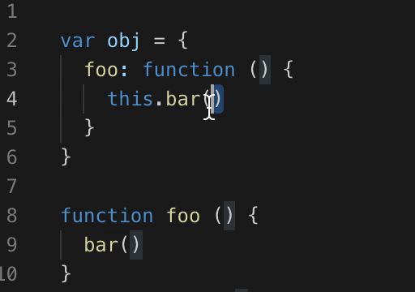
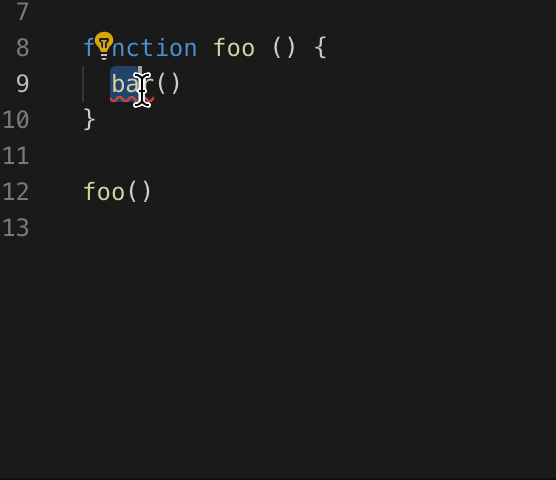

# vscode-js-add-function README

Easily add your already written function to your file.

## Installing

Extension is available for free in the Visual Studio Code Marketplace.

## Features

Select the function you want to add whether as method which is invoked in object context or as an unbound function.

<!-- ```
var obj = {
    foo: function() {
        this.bar()   
    }
    bar: function() {
    // do your stuff
    }
};
``` -->

### Object Context



<!-- 
```
function foo() {
    bar()
}

function bar() {
    // do your stuff
}
``` -->

### Unbound Function



## Usage

1. Highlight a written function
2. Press Cmd+Shift+A
3. The function will be added at the end of object or file


## Known Issues

Methods in object context are not added with the correct white space. You have to tab to do your stuff.
